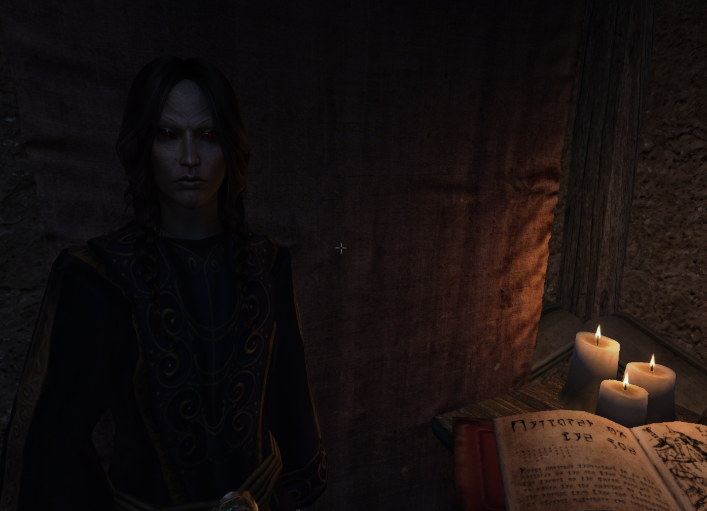
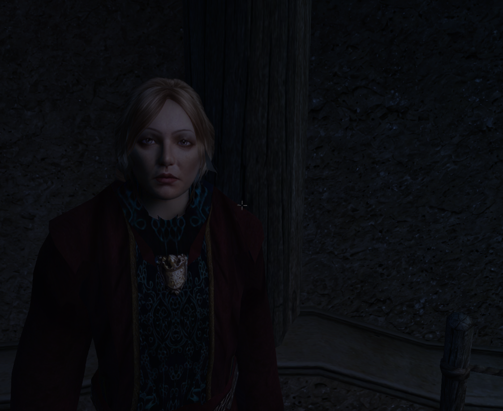

# OpenMW Zink DLSS 5 Kit

This is an experimental way to run DLSS 5 Neural Rendering in OpenMW on Windows.
It does not replace OpenMW's renderer. Instead, it translates OpenMW's OpenGL output
to Vulkan and feeds that image into DLSS through ReShade:

```text
OpenMW -> OpenGL -> Mesa Zink -> Vulkan -> ReShade -> DLSS5-Feeder -> DLSS 5
```

I built and tested this on an RTX 3090 with OpenMW 0.51.0 and NVIDIA driver 616.56.
The same community tools are meant to support RTX 20-, 30-, 40-, and 50-series cards,
but I have only personally confirmed my own RTX 3090 setup.

This is a community experiment, not an official OpenMW or NVIDIA release. NVIDIA
officially targets DLSS 5 at RTX 50-series hardware. Running it on an older RTX card
through DLSS5-Feeder and RenoDX is unsupported and may behave differently from one
driver or GPU to another. Please feel free to fork as needed.

[Download the latest release](https://github.com/magnesiumdreamz/openmw-zink-dlss5-kit/releases/latest)
or clone `main` for the same tested installer files.

## Demo

[Watch the OpenMW DLSS 5 video demonstration on YouTube](https://www.youtube.com/watch?v=XIfJCVSPQsg).

Here are a few screens from the Mages Guild in Balmora:





## What this repository does

The installer takes an OpenMW installation and builds a separate Zink/DLSS copy. Your
original OpenMW folder is left alone. The kit adds:

- Mesa Zink, which translates OpenGL to Vulkan;
- launchers for OpenMW and the OpenMW Launcher;
- the ReShade configuration used by the working RTX 3090 setup;
- DLSS5-Feeder configuration and stable shader order;
- fixes for transparent windows and white/grey presentation glitches;
- optional MXAO and depth-debugging presets;
- an optional stable-settings and mod-profile setup tool.

It does **not** include Morrowind, OpenMW, ReShade, Mesa, NVIDIA DLLs, or the other
third-party binaries. Those files have their own licenses and must be downloaded from
their original or otherwise authorized sources.

## Before you start

You need:

1. OpenMW 0.51.0 with a working, legal Morrowind installation.
2. A 64-bit MSVC Mesa package containing `opengl32.dll` and `libgallium_wgl.dll`.
3. ReShade with add-on support, installed as a Vulkan layer. You also need
   `ReShade.fxh` and `ReShadeUI.fxh` from the ReShade shader repository.
4. Git for Windows and the Visual Studio C++ Build Tools. The installer can download,
   patch, and compile DLSS5-Feeder automatically.
5. VORT motion estimation, including `vort_Motion.fx`, its includes, and textures.
6. qUINT MXAO, including `qUINT_mxao.fx` and `qUINT_common.fxh`.
7. The RenoDX/RHI DLSS components: `renodx-dlss5.addon64`, an authorized
   `nvngx_dlss.dll`, and `nvngx_dlssnr.dll`.

[Download the pinned, validated versions](docs/downloads.md), then read
[THIRD_PARTY.md](THIRD_PARTY.md) for licensing and redistribution notes.

## Installing the kit

Download or clone this repository, open **PowerShell as administrator** in its folder,
and run the following complete example. Change every example path to match your
computer:

```powershell
.\scripts\Install-OpenMWDLSS5Kit.ps1 `
  -OpenMWPath 'C:\Program Files\OpenMW 0.51.0' `
  -DestinationPath 'C:\Games\OpenMW-Zink-DLSS5' `
  -MesaPath 'C:\Downloads\mesa3d-msvc' `
  -ReShadeShaderPath 'C:\Downloads\reshade-shaders' `
  -BuildPatchedFeeder `
  -VortPath 'C:\Downloads\vort_Shaders' `
  -QuintPath 'C:\Downloads\qUINT' `
  -RenoDXPath 'C:\Downloads\RHI-components' `
  -ReShadeConfigName 'ReShade.ini' `
  -ApplyStableSettings `
  -CreateDesktopShortcuts `
  -RegisterReShade `
  -ImportProfilePath 'C:\Backups\OpenMW-profile' `
  -ModRoot 'C:\Games\Morrowind-Mods\mods' `
  -BaseDataPath 'C:\Games\Morrowind\Data Files' `
  -OverwritePath 'C:\Games\Morrowind-Mods\overwrite' `
  -AdditionalDataPath @(
    'C:\Games\Morrowind-Mods\groundcover',
    'C:\Games\Morrowind-Mods\creature-replacements'
  )
```

If you do not have a saved OpenMW mod profile, remove `-ImportProfilePath`, `-ModRoot`,
`-BaseDataPath`, `-OverwritePath`, and `-AdditionalDataPath`. The remaining command
still performs the complete normal setup: stable settings, feeder build, shortcuts,
and ReShade registration. Administrator mode is needed only for `-RegisterReShade`.

The installer checks that the files it needs are present before it writes the runtime.
It will not overwrite a non-empty destination unless you add `-UpdateExisting`, and
it backs up integration files that it replaces.

By default, the installer also backs up and applies the tested OpenMW stability
settings. Add `-SkipStableSettings` to leave your user `settings.cfg` unchanged.
Desktop shortcuts, mod import, and system ReShade registration remain opt-in.

`-BuildPatchedFeeder` downloads the commit-pinned feeder, NVIDIA NGX SDK, Vulkan
headers, and validated feeder shader; applies the included resize-safety patch; and
compiles the add-on. It does not download the proprietary runtime DLLs used by
RenoDX. If you already built the validated feeder, replace the switch with
`-FeederPath 'C:\path\to\feeder-output'`.

This switch automates only the feeder build. ReShade's Vulkan layer must still be
installed separately, and the RenoDX/NVIDIA runtime files must still be obtained
through an authorized RHI workflow and supplied with `-RenoDXPath`.

## Recommended setup options

The stable settings disable MSAA, VSync, and the frame limiter, use a 16,310-unit view
distance, and enable object paging. The following additional options are opt-in:

- `-CreateDesktopShortcuts` adds shortcuts for the game and OpenMW Launcher.
- `-RegisterReShade` points the system ReShade Vulkan layer at the new `openmw.exe`.
  This option requires PowerShell to be run as administrator and backs up the previous
  registration.
- `-ImportProfilePath` and `-ModRoot` import a saved OpenMW plugin and groundcover
  profile. The script checks every directory and plugin before changing the profile.
  Use `-BaseDataPath`, `-OverwritePath`, and `-AdditionalDataPath` when the saved
  profile came from a different folder layout.

Profile and settings changes receive timestamped backups. You can preview the profile
tool without writing anything by running `Configure-OpenMWStableProfile.ps1 -WhatIf`.

The installer accepts either the previously tested resize-safe feeder binary or a
feeder produced from the pinned source and patch by `-BuildPatchedFeeder`. An unknown
external binary stops installation before anything is written. `-AllowUnvalidatedFeeder`
is an advanced escape hatch and may introduce resolution-change crashes.

## Problems encountered while building this

- **Transparent game window:** blended areas showed the desktop and other applications.
  The installed `OpenMW_OpaquePresent` shader forces final alpha to opaque and is placed
  last in the preset.
- **White or grey flickering:** the final presentation fix, minimal shader set, and
  removal of unstable experimental lighting effects substantially reduced it.
- **Resolution changes froze or crashed:** the feeder destroyed Vulkan resources that
  were still in use. Installation now requires the validated device-idle/resize-safe
  feeder build unless the safety check is explicitly overridden.
## Starting OpenMW

If you did not create desktop shortcuts, open the destination folder and use:

- `Launch-OpenMW-Launcher-Zink.cmd` to change OpenMW settings;
- `Launch-OpenMW-Zink.cmd` to start the game.

Once you load a save:

1. Open ReShade and select `OpenMW-Stable.ini`.
2. Confirm the enabled effects are ordered as follows:
   `vort_MotionEffects`, `DLSS5_Feed`, then `OpenMW_OpaquePresent`.
3. Check `dlss5-feed.log` after exiting. A successful run contains `feature ready`
   followed by delivered frames.

Only use `OpenMW-Depth-Diagnostic.ini` after loading into the world. It is a debugging
preset, not a normal gameplay preset. MXAO is optional and disabled in the stable
preset.

OpenMW saves in-game setting changes to its normal user `settings.cfg` when the game
exits normally. A crash or forced termination may lose changes from that session.

## Performance tips

Neural Rendering is expensive. If performance is poor, try OpenMW at
`1920x1080` or lower in windowed or borderless mode.

You can optionally use [Lossless Scaling](https://losslessscaling.com/) to scale that
window to your monitor and add LSFG frame generation.

## Current limitations

- Motion vectors are estimated because OpenMW does not yet provide native vectors to
  this integration.
- The HUD is processed together with the 3D scene, so text and UI can show temporal
  artifacts.
- DLSS currently runs at the game's output resolution. This is neural rendering/DLAA,
  not normal DLSS Super Resolution.
- Do not combine this configuration with OptiScaler or NVIDIA Smooth Motion.
- ReShade full add-on builds should not be used in anti-cheat multiplayer games.
- NVIDIA neural-runtime DLLs are proprietary and cannot be redistributed here.

For detailed setup notes, see [docs/installation.md](docs/installation.md). For known
problems and fixes, see [docs/troubleshooting.md](docs/troubleshooting.md). The tested
hardware and software matrix is in [COMPATIBILITY.md](COMPATIBILITY.md).
